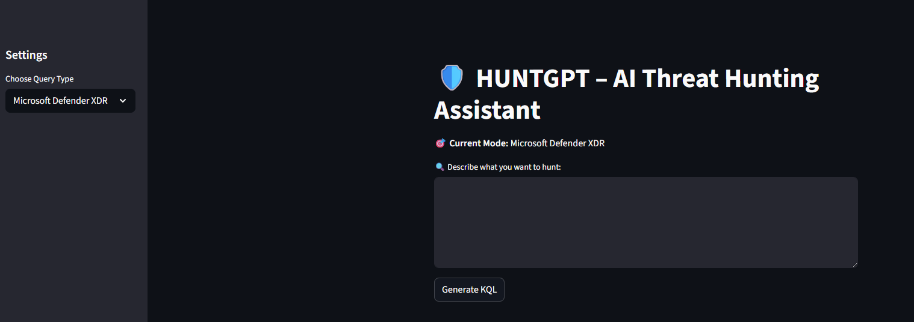

# huntgpt
An AI-native security assistant that helps SOC analysts and threat hunters generate queries via natural language.


---

## 🚀 Features in phase 1

- 💬 **Natural Language to KQL** – Describe your hunt, get ready-to-run queries.
---

## 🛠️ Tech Stack

| Component       | Tech                         |
|----------------|------------------------------|
| Backend         | Python                       |
| Frontend        | Streamlit                    |
| AI Engine       | Ollama LLM                   |

---

## 🧪 Demo

```bash
# Run the app
streamlit run main.py


Example Prompts
"Show me failed RDP logons from outside NZ in the past week."
"Summarize this Defender alert JSON for triage."
"List MITRE techniques used in ransomware campaigns."
